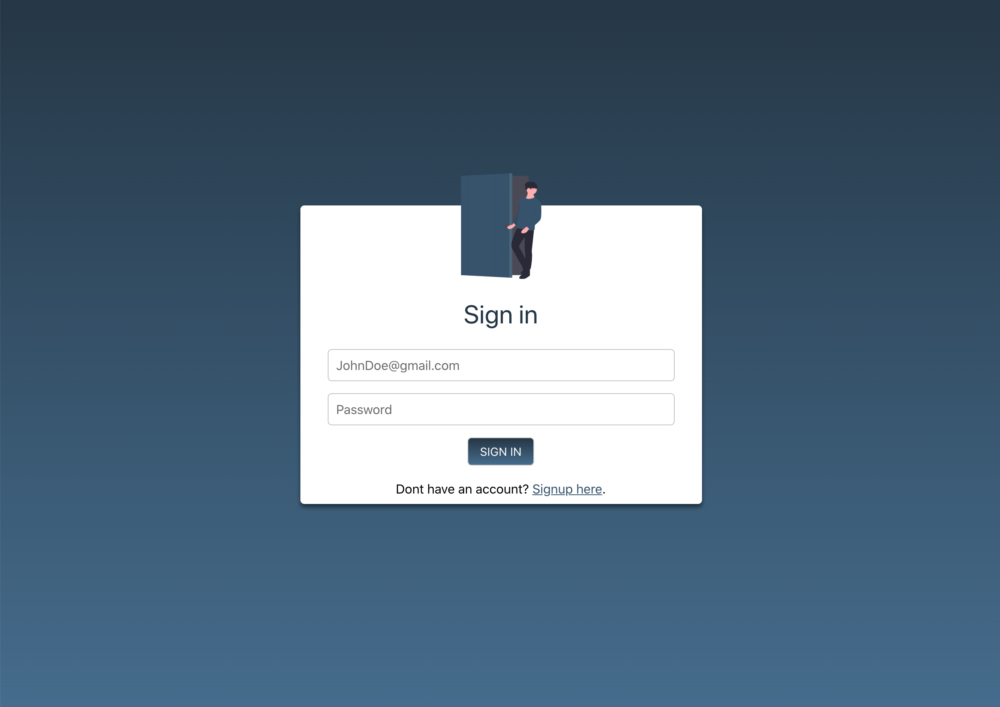
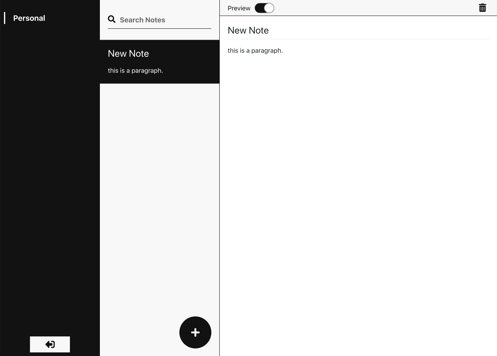

A practice application.

Learning context api with use_reducer. 

Libraries worth mentioning: styled-components, react-animated, firebase

To try locally: 
1. create .env file in root
2. copy paste from .env.example and fill with your firebase secrets
3. `npm install`
4. `npm start`

### Sign in screen

### Dashboard

[DEMO](https://unruffled-newton-aee93c.netlify.app/)
